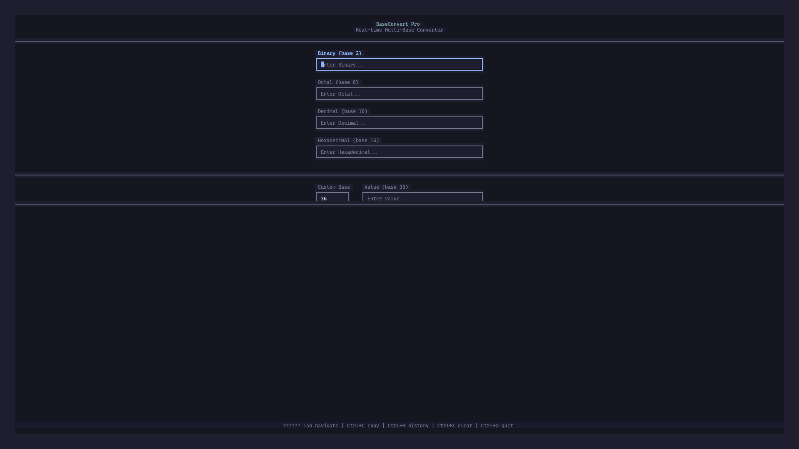

# BaseConvert Pro

Disclaimer: This project was vibecoded using Kimi 2.6 simply because I needed a good base converter and couldn't be bothered to write it.

A beautiful, real-time multi-base converter TUI built in Zig.



## Features

- **Real-time Conversion**: Type in any base field and see instant conversions to all other bases
- **Multiple Bases Supported**: Binary (2), Octal (8), Decimal (10), Hexadecimal (16), plus any custom base from 2-36
- **Beautiful UI**: Carefully crafted color scheme with Catppuccin-inspired palette, rounded borders, and smooth cursor blinking
- **Keyboard Navigation**: Full keyboard control with vim-inspired shortcuts
- **History Panel**: Toggleable history of your recent conversions (Ctrl+H)
- **Value Insights**: See ASCII representation, bit width, byte breakdown, and power-of-2 detection
- **Copy Support**: Copy current field value to clipboard (Ctrl+C)
- **Efficient**: Built with Zig and libvaxis for minimal resource usage

## Installation

```bash
# Clone the repository
git clone https://github.com/ChromMob/zig-baseconv
cd zig-baseconv

# Build with Zig 0.15+
zig build -Doptimize=ReleaseFast

# Run
./zig-out/bin/baseconv
```

## Usage

### Navigation

| Key | Action |
|-----|--------|
| `Tab` | Next field |
| `Shift+Tab` | Previous field |
| `↑` / `↓` | Navigate fields |
| `←` / `→` | Move cursor in field |
| `Ctrl+A` / `Home` | Go to start of field |
| `Ctrl+E` / `End` | Go to end of field |

### Editing

| Key | Action |
|-----|--------|
| `Backspace` | Delete before cursor |
| `Delete` / `Ctrl+D` | Delete after cursor |
| `Ctrl+W` | Delete word before cursor |
| `Ctrl+K` | Delete to end of line |
| `Ctrl+U` | Delete to start of line |

### Actions

| Key | Action |
|-----|--------|
| `Ctrl+C` | Copy current field value |
| `Ctrl+X` | Clear all fields |
| `Ctrl+H` | Toggle history panel |
| `Ctrl+Q` | Quit |

## How It Works

BaseConvert Pro uses a centralized conversion engine. When you type in any field:

1. The input is parsed as a number in its respective base
2. The value is converted to all other supported bases
3. All fields update simultaneously in real-time
4. Valid conversions are added to the history

## Custom Base

The custom base field (default: 36) allows you to convert to and from any base between 2 and 36. Simply:

1. Enter your desired base (2-36) in the "Custom Base" field
2. Type a value in the "Value" field using that base
3. Watch all standard fields update automatically

## Architecture

Built with:
- **Zig 0.15+**: Modern systems programming language
- **libvaxis**: Advanced TUI library with RGB support, mouse handling, and modern terminal features
- **vxfw**: Flutter-inspired widget framework for composable UIs

## License

MIT License - see LICENSE file for details.
